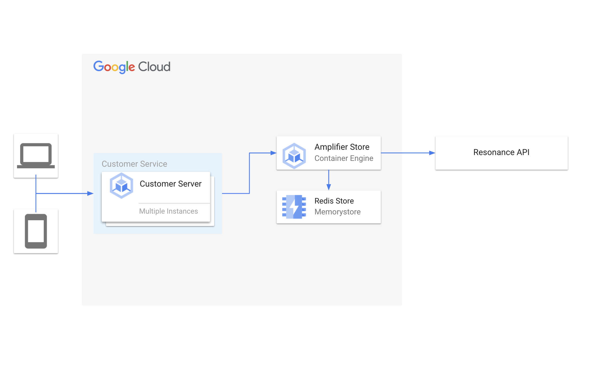

# Resonance Amplifier Store

Amplifier Store by Resonance is an essential part of the Resonance architecture. Amplifier store is
used as a cache for Resonance customizations created using the Resonance dashboard. An instance of
Amplifier Store is deployed in your cloud so you can serve customizations to your customers at the
lowest cost and latency.

## Architecture



# Installation

## Step 0: Start a Redis Instance

Before you begin the installation procedure, you will need to deploy an instance of Redis to
Google Cloud. For instructions on deploying Redis using Google Cloud's Memorystore, please read the
[Google Documentation](https://cloud.google.com/memorystore/docs/cluster/memorystore-for-redis-cluster-overview)

## Quick install with Google Cloud Marketplace

Get up and running with a few clicks! Install this Ory Hydra app to a Google Kubernetes Engine
cluster using Google Cloud Marketplace. Follow the
[on-screen instructions](https://console.cloud.google.com/marketplace/details/google/amplifier-store)

## Command line instructions

You can use [Google Cloud Shell](https://cloud.google.com/shell/) or a local
workstation to complete these steps.

### Prerequisites

#### Set up command-line tools

You'll need the following tools in your development environment. If you are
using Cloud Shell, `gcloud`, `kubectl`, Docker, and Git are installed in your
environment by default.

- [gcloud](https://cloud.google.com/sdk/gcloud/)
- [kubectl](https://kubernetes.io/docs/reference/kubectl/overview/)
- [docker](https://docs.docker.com/install/)
- [git](https://git-scm.com/book/en/v2/Getting-Started-Installing-Git)
- [envsubst](https://command-not-found.com/envsubst)

Configure `gcloud` as a Docker credential helper:

```shell
gcloud auth configure-docker
```

#### Create a Google Kubernetes Engine cluster

Create a new cluster from the command line:

```shell
export CLUSTER=hydra-cluster
export ZONE=us-west1-a

gcloud container clusters create "$CLUSTER" --zone "$ZONE"
```

Configure `kubectl` to connect to the new cluster:

```shell
gcloud container clusters get-credentials "$CLUSTER" --zone "$ZONE"
```

#### Clone this repo

Clone this repo and the associated tools repo.

```shell
git clone https://github.com/resonance-run/amplifier-store-google-cloud-marketplace.git
```

#### Install the Application resource definition

An Application resource is a collection of individual Kubernetes components,
such as Services, Deployments, and so on, that you can manage as a group.

To set up your cluster to understand Application resources, run the following
command:

```shell
kubectl apply -f "https://raw.githubusercontent.com/GoogleCloudPlatform/marketplace-k8s-app-tools/master/crd/app-crd.yaml"
```

You need to run this command once.

The Application resource is defined by the
[Kubernetes SIG-apps](https://github.com/kubernetes/community/tree/master/sig-apps)
community. The source code can be found on
[github.com/kubernetes-sigs/application](https://github.com/kubernetes-sigs/application).

### Install the Application

#### Configure the app with environment variables

Choose an instance name and
[namespace](https://kubernetes.io/docs/concepts/overview/working-with-objects/namespaces/)
for the app. In most cases, you can use the `default` namespace.

```shell
export APP_INSTANCE_NAME=amplifier-store-1
export NAMESPACE=default
```

Set up the image tag:

It is advised to use stable image reference which you can find on
[Marketplace Container Registry](https://console.cloud.google.com/artifacts/docker/amplifier-store-public/us/gcr.io/amplifier-store).

Example:

```shell
export TAG="0.0.5-<BUILD_ID>"
```

Alternatively you can use short tag which points to the latest image for selected version.

> Warning: this tag is not stable and referenced image might change over time.

```shell
export TAG="0.0"
```

Set the Redis URL for the Redis instance you created:

```shell
export REDIS_URL="redis://X.X.X.X"
```

Set up the connection with Resonance. These values will come from the Resonance Dashboard:

```shell
export RESONANCE_CLIENT_ID="[unique_id]"
export RESONANCE_API_KEY="[resonance_api_key]"
```

#### Create namespace in your Kubernetes cluster

If you use a different namespace than `default`, run the command below to create
a new namespace:

```shell
kubectl create namespace "$NAMESPACE"
```

#### Configure the service account

The operator needs a service account in the target namespace with cluster wide
permissions to manipulate Kubernetes resources.

Provision a service account and export its via an environment variable as follows:

```shell
kubectl create serviceaccount "${APP_INSTANCE_NAME}-sa" --namespace "${NAMESPACE}"
kubectl create clusterrolebinding "${NAMESPACE}-${APP_INSTANCE_NAME}-sa-rb" --clusterrole=cluster-admin --serviceaccount="${NAMESPACE}:${APP_INSTANCE_NAME}-sa"
export SERVICE_ACCOUNT="${APP_INSTANCE_NAME}-sa"
```

#### Expand the manifest template

Use `envsubst` to expand the template. We recommend that you save the
expanded manifest file for future updates to the application.

```shell
awk 'FNR==1 {print "---"}{print}' manifest/* \
  | envsubst '$APP_INSTANCE_NAME $NAMESPACE $REDIS_URL $RESONANCE_CLIENT_ID $RESONANCE_API_KEY $SERVICE_ACCOUNT' \
  > "${APP_INSTANCE_NAME}_manifest.yaml"
```

#### Apply the manifest to your Kubernetes cluster

Use `kubectl` to apply the manifest to your Kubernetes cluster:

```shell
kubectl apply -f "${APP_INSTANCE_NAME}_manifest.yaml" --namespace "${NAMESPACE}"
```

#### View the app in the Google Cloud Console

To get the Console URL for your app, run the following command:

```shell
echo "https://console.cloud.google.com/kubernetes/application/${ZONE}/${CLUSTER}/${NAMESPACE}/${APP_INSTANCE_NAME}"
```

To view your app, open the URL in your browser.
